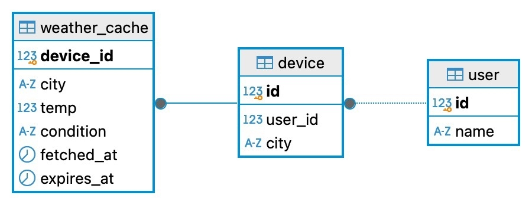

# Weather (Go + PostgreSQL + OpenWeatherMap + DB cache)

Сервис на Go хранит настройки пользователя/устройства в PostgreSQL, ходит в OpenWeatherMap за погодой, кэширует результат в БД, чтобы не дергать внешний API слишком часто, и отдает данные фронтенду.

## Стек

- Go (net/http + gorilla/mux)
- PostgreSQL (pgxpool)
- OpenWeatherMap API
- Frontend: статические файлы в папке `frontend/`

## Запуск

### 1) Подготовьте окружение

Скопируйте `.env.example` в `.env` и заполните значения:
```bash
cp .env.example .env
```

Пример `.env`:
```bash
PORT=8080
POSTGRES_DB=postgres
DBHost=localhost
DB_PORT=5433
DB_USER=postgres
DB_PASSWORD=password
OPENWEATHERMAP_API_KEY=your_api_key_here
OPENWEATHERMAP_BASE_URL=https://api.openweathermap.org
WEATHER_CACHE_TTL_SECONDS=600
```

### 2) Поднимите PostgreSQL
```bash
docker compose up -d
```

### 3) Запустите Go-сервер
```bash
go run ./cmd/app.go
```

Сервер:
- слушает `PORT`
- раздает frontend на `/`
- предоставляет API эндпоинты `/create_user` и `/api/weather`

## Frontend

Откройте в браузере: `http://localhost:8080/`

На странице:
- задайте `name` и `city` и нажмите кнопку "Создать устройство"
- по кнопке "Обновить погоду" будет выполняться `GET /api/weather`

`device_id` сохраняется в `localStorage`, поэтому повторные обновления идут с тем же устройством.

## API

### 1) Создание пользователя/устройства

`POST /create_user`

Тело запроса (JSON):
```json
{
  "name": "Иван",
  "city": "Москва"
}
```

Ответ (JSON):
```json
{
  "device_id": 1
}
```

### 2) Получение погоды (с кэшированием)

`GET /api/weather`

Идентификатор устройства передаётся одним из способов:
- query param: `/api/weather?device_id=1`
- или header: `X-Device-Id: 1`

Если `device_id` не передан — возвращается `401 Unauthorized`.

Ответ (JSON):
```json
{
  "city": "Москва",
  "temp": 5.2,
  "condition": "облачно",
  "from_cache": true
}
```

`from_cache` показывает, был ли ответ взят из `weather_cache`.

### Коды ответов

| Код | Описание |
|-----|----------|
| 200 | Успешный ответ |
| 201 | Устройство создано |
| 400 | Неверный запрос (невалидные данные) |
| 401 | device_id не передан |
| 404 | Устройство не найдено |
| 405 | Метод не поддерживается |
| 502 | Ошибка запроса к OpenWeatherMap |

## Схема базы данных

Таблицы создаются автоматически при старте сервиса (миграция в коде).

### ER-диаграмма



### Таблицы

**`user`**
- `id` BIGSERIAL PRIMARY KEY
- `name` TEXT NOT NULL

**`device`**
- `id` BIGSERIAL PRIMARY KEY
- `user_id` BIGINT NOT NULL REFERENCES `user(id)` ON DELETE CASCADE
- `city` TEXT NOT NULL

**`weather_cache`**
- `device_id` BIGINT PRIMARY KEY REFERENCES `device`(id) ON DELETE CASCADE
- `temp` DOUBLE PRECISION NOT NULL
- `condition` TEXT NOT NULL
- `fetched_at` TIMESTAMPTZ NOT NULL
- `expires_at` TIMESTAMPTZ NOT NULL


## Безопасность

### Защита от SQL-инъекций

Все запросы к PostgreSQL используют параметризованные плейсхолдеры через библиотеку pgx — значения никогда не подставляются напрямую в строку запроса:
```go
tx.QueryRow(ctx, `INSERT INTO "user"(name) VALUES ($1) RETURNING id`, name)
q.runner.QueryRow(ctx, `SELECT city FROM "device" WHERE id = $1`, deviceID)
```

Передача строк вида `'; DROP TABLE users; --` не оказывает никакого эффекта.

### Валидация входных данных

- Поля `name` и `city` не могут быть пустыми
- Длина полей `name` и `city` ограничена 100 символами
- `device_id` принимается только как целое число — строки и SQL-конструкции отклоняются с кодом 400
- Запрос без `device_id` возвращает 401

### Известные ограничения

| # | Описание |
|---|----------|
| 1 | Порт PostgreSQL (5433) проброшен на все интерфейсы хоста — только для локальной разработки |

## Тестирование безопасности

Для запуска автоматических тестов безопасности:
```bash
bash security_test.sh
```

Результаты последнего прогона — **20/20 PASS**:
```
БЛОК 1 — Базовая работа
✅ PASS — Создание устройства (код: 201)
✅ PASS — Получение погоды по device_id=1 (код: 200)
✅ PASS — Кэш работает (from_cache: true при повторном запросе)

БЛОК 2 — Несанкционированный доступ
✅ PASS — Запрос без device_id → 401 (код: 401)
✅ PASS — Несуществующий device_id=999999 → 404 (код: 404)
✅ PASS — Отрицательный device_id=-1 → 404 (код: 404)
✅ PASS — Нулевой device_id=0 → 404 (код: 404)

БЛОК 3 — SQL-инъекции
✅ PASS — Инъекция DROP TABLE в name → 201 (код: 201)
✅ PASS — Инъекция OR 1=1 в city → 201 (код: 201)
✅ PASS — Инъекция в device_id (OR 1=1) → 400 (код: 400)
✅ PASS — Time-based инъекция в device_id → 400 (код: 400)
✅ PASS — Сервер не завис (ответ за 0с, не 5с)
✅ PASS — БД жива после инъекций → 201 (код: 201)

БЛОК 4 — Валидация полей
✅ PASS — Пустые поля → 400 (код: 400)
✅ PASS — Имя длиннее 100 символов → 400 (код: 400)
✅ PASS — Город длиннее 100 символов → 400 (код: 400)
✅ PASS — Сломанный JSON → 400 (код: 400)
✅ PASS — Неверный Content-Type → 400 (код: 400)

БЛОК 5 — Неподдерживаемые методы
✅ PASS — DELETE /api/weather → 405 (код: 405)
✅ PASS — PUT /create_user → 405 (код: 405)
✅ PASS — Несуществующий эндпоинт /api/admin → 404 (код: 404)

ИТОГ: ✅ PASS: 20 | ❌ FAIL: 0
```

Полный отчёт о тестировании безопасности: [SECURITY.md](./SECURITY.md)

## Проверка вручную через curl

Создать устройство:
```bash
curl -s -X POST http://localhost:8080/create_user \
  -H "Content-Type: application/json" \
  -d '{"name":"Иван","city":"Москва"}'
```

Получить погоду:
```bash
curl -s "http://localhost:8080/api/weather?device_id=1"
```